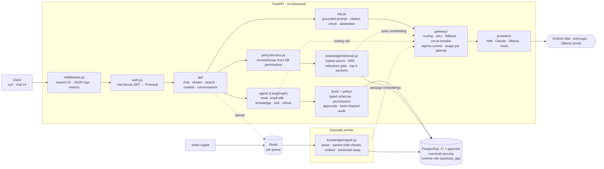

# Architecture

> The engineering view of the system. The cross-team overview is [`README.md`](README.md);
> each decision below has its own record in [`docs/decisions/`](docs/decisions/README.md).
> This document describes only what the code actually does.

## 1. Request path

The system is one vertical slice. Every request passes the same trust boundaries in order:

```
Client (curl / chat UI / Flowise demo)
  │  bearer token
  ▼
FastAPI ─ CorrelationMiddleware (request ID, JSON log line, HTTP metrics)
  │       RateLimitMiddleware (per-caller token buckets in Redis, D-61)
  ▼
AuthN → Principal{user, department, permissions}  (JWT; permissions loaded per request)
  ▼
Orchestrator (LangGraph) ─ small talk | knowledge | tool | refuse
  ├─ Retrieval: AccessScope -> SQL filter + Postgres RLS -> hybrid rank -> gate -> top-K
  ├─ Policy engine: authorizes each tool call against the principal
  ├─ Tools: typed schemas, pending-action approval for sensitive ones
  └─ Provider gateway: routing, retry, timeout, fallback, usage
  ▼
Response with citations ─ audit record (hash-chained) ─ metrics ─ trace (Opik, optional)
```

The model is treated as an untrusted planner. It never holds credentials, never sees
documents the caller cannot read, and its tool requests are re-validated by the policy
engine before anything executes.

## 2. Components

| Component | Technology | Responsibility |
|---|---|---|
| API | Python 3.12, FastAPI, Pydantic v2 | Contracts, auth, orchestration, policy |
| Relational store | PostgreSQL 17 | Users, conversations, usage, pending actions, audit |
| Vector store | pgvector (same Postgres) | Chunk embeddings + department / classification / version metadata |
| Cache, limits, queue | Redis 7 | Rate limits, cache, worker broker |
| Worker | Dramatiq on Redis | Ingestion and re-indexing with retries and a dead-letter queue |
| LLM providers | NVIDIA NIM (OpenAI-compatible), Claude (official Anthropic SDK), Ollama (native API), deterministic mock | Behind `ChatProvider` / `EmbeddingProvider` protocols |
| Observability | structlog JSON, Prometheus, Opik (optional profile) | Logs, metrics, LLM traces and eval experiments |
| Console | `web/index.html` served at `/ui` (dev/test) | Client only: renders what the API returns, holds no policy or credentials (D-62) |
| Demo UI | Flowise (optional profile) | Thin client of `/api/chat` only — holds no policy or credentials |


### Module map



### Document ingestion

Diagram: [README - End-to-end: a document](README.md#end-to-end-a-document). The stages are implemented in
`knowledge/ingest.py` and `knowledge/chunking.py`; the retry and dead-letter rules are
D-24, the versioned swap D-23.

## 3. Decision records

Each decision - context, the alternatives considered, the measurement where there was
one, and the consequences - lives in its own file under
[`docs/decisions/`](docs/decisions/README.md), so this document stays readable and the
reasoning stays available.

| # | Decision | Area |
|---|---|---|
| [D-01](docs/decisions/D-01-pgvector-in-the-primary-postgres-instead-of-a-de.md) | pgvector in the primary Postgres instead of a dedicated vector DB | Storage |
| [D-02](docs/decisions/D-02-deterministic-mock-provider-as-a-first-class-ada.md) | Deterministic mock provider as a first-class adapter | Providers |
| [D-03](docs/decisions/D-03-readiness-vs-liveness.md) | Readiness vs liveness | Operations |
| [D-04](docs/decisions/D-04-correlation-ids-accept-caller-input-only-if-log.md) | Correlation IDs accept caller input only if log-safe | Operations |
| [D-05](docs/decisions/D-05-metric-labels-are-bounded.md) | Metric labels are bounded | Operations |
| [D-06](docs/decisions/D-06-flowise-is-a-client-not-the-orchestrator.md) | Flowise is a client, not the orchestrator | Scope |
| [D-07](docs/decisions/D-07-cubejs-not-used.md) | CubeJS not used | Scope |
| [D-08](docs/decisions/D-08-role-bound-jwt-local-issuer-as-a-stand-in-for-th.md) | Role-bound JWT; local issuer as a stand-in for the company IdP | Security |
| [D-10](docs/decisions/D-10-provider-abstraction-and-routing.md) | Provider abstraction and routing | Providers |
| [D-11](docs/decisions/D-11-retry-fallback-and-circuit-breaking-rules.md) | Retry, fallback and circuit-breaking rules | Providers |
| [D-12](docs/decisions/D-12-embeddings-never-fall-back-across-models.md) | Embeddings never fall back across models | Providers |
| [D-13](docs/decisions/D-13-streaming-fallback-only-before-the-first-token-c.md) | Streaming: fallback only before the first token; cancellation propagates | Providers |
| [D-14](docs/decisions/D-14-usage-accounting-per-attempt.md) | Usage accounting per attempt | Providers |
| [D-15](docs/decisions/D-15-data-classification-routing-to-providers-confirm.md) | Data-classification routing to providers (confirmed with the team lead) | Security |
| [D-16](docs/decisions/D-16-three-model-picker-and-switching-within-a-conver.md) | Three-model picker and switching within a conversation | Providers |
| [D-17](docs/decisions/D-17-least-privilege-runtime-database-role-security-f.md) | Least-privilege runtime database role (security finding) | Security |
| [D-20](docs/decisions/D-20-ingestion-parsing-metadata-chunking-embeddings.md) | Ingestion: parsing, metadata, chunking, embeddings | Knowledge |
| [D-21](docs/decisions/D-21-retrieval-hybrid-search-fusion-relevance-gate-to.md) | Retrieval: hybrid search, fusion, relevance gate, top-K | Knowledge |
| [D-22](docs/decisions/D-22-department-isolation-application-filter-row-leve.md) | Department isolation: application filter + row-level security | Security |
| [D-23](docs/decisions/D-23-document-lifecycle-and-re-indexing.md) | Document lifecycle and re-indexing | Knowledge |
| [D-24](docs/decisions/D-24-ingestion-worker-retries-and-dead-letter-queue.md) | Ingestion worker, retries and dead-letter queue | Knowledge |
| [D-25](docs/decisions/D-25-retrieved-content-is-untrusted.md) | Retrieved content is untrusted | Security |
| [D-26](docs/decisions/D-26-agent-orchestration-on-langgraph.md) | Agent orchestration on LangGraph | Agent |
| [D-27](docs/decisions/D-27-upload-an-authorized-user-becomes-a-content-sour.md) | Upload: an authorized user becomes a content source | Security |
| [D-28](docs/decisions/D-28-the-router-runs-on-its-own-fast-model-measured.md) | The router runs on its own fast model (measured) | Agent |
| [D-29](docs/decisions/D-29-tool-contracts-and-what-the-model-may-influence.md) | Tool contracts and what the model may influence | Agent |
| [D-30](docs/decisions/D-30-server-status-field-level-policy.md) | Server status: field-level policy | Security |
| [D-31](docs/decisions/D-31-sensitive-actions-propose-confirm-execute-once.md) | Sensitive actions: propose, confirm, execute once | Security |
| [D-32](docs/decisions/D-32-tamper-evident-audit.md) | Tamper-evident audit | Security |
| [D-40](docs/decisions/D-40-memory-allowlist-not-model-judgement.md) | Memory: allowlist, not model judgement | Memory |
| [D-50](docs/decisions/D-50-evaluation-design.md) | Evaluation design: deterministic rules, judged prose | Evaluation |
| [D-60](docs/decisions/D-60-scale-proposal-aws.md) | Scale proposal on AWS (5,000 employees, 1M documents) | Scale |
| [D-61](docs/decisions/D-61-rate-limiting-per-caller-token-buckets.md) | Rate limiting: per-caller token buckets, fail open | Operations |
| [D-62](docs/decisions/D-62-console-ui-is-a-client.md) | The console is a client, dev/test only | Scope |
| [D-63](docs/decisions/D-63-tickets-are-operational-data.md) | Tickets are operational data, read by a tool | Agent |

### Confirmed with the team lead (2026-09-23)
| Question | Answer | Effect on the build |
|---|---|---|
| Is `vpn:approve` global or per department? | Only the IT Head grants VPN access for other departments | Matches: `vpn:approve` is a central authority, not department-scoped. In the fixture only U002 holds it, so U002 plays that role; requester and approver must still differ. |
| What may persistent memory store? | "any will do" | Kept the allowlist (the brief requires "selected, permitted facts" and no secrets), now extendable per deployment through `OPSASSIST_MEMORY_EXTRA_KEYS`. |
| May internal/confidential documents go to Claude or similar? | Confidential must not be exposed to external models; use roles and permissions | Implemented as D-15: the context's highest classification is compared against `OPSASSIST_EGRESS_MAX_CLASSIFICATION`. |
| Should RAG enforce permissions at retrieval time? | "suggest your idea" | Our answer: yes, and in two layers - the SQL filter *and* Postgres row-level security under a non-superuser role, with confidential material in a separate table (D-17, D-22). Filtering after retrieval would already have put the text in memory next to the model. |
| Which cloud for the scale proposal? | AWS (used in production today) | The day-6 proposal targets AWS concretely (D-50 note below). |

## 4. Security model (engineering view)

The cross-team summary is in [the README](README.md#security-and-data-boundaries). At
engineering level, each control is one of these, and each has its own record:

| Control | Where it lives | Record |
|---|---|---|
| Role-bound tokens; permissions read from the database per request | `auth.py` | [D-08](docs/decisions/D-08-role-bound-jwt-local-issuer-as-a-stand-in-for-th.md) |
| Access scope from permissions; SQL filter + Postgres RLS in one transaction | `policy/access.py`, `knowledge/retrieval.py` | [D-22](docs/decisions/D-22-department-isolation-application-filter-row-leve.md) |
| Runtime database role that cannot bypass RLS | migration 0005 | [D-17](docs/decisions/D-17-least-privilege-runtime-database-role-security-f.md) |
| Confidential material in a separate index, on-box models only | migration 0004, gateway | [D-15](docs/decisions/D-15-data-classification-routing-to-providers-confirm.md) |
| Retrieved text as escaped, unauthorized data; validated citations | `rag.py` | [D-25](docs/decisions/D-25-retrieved-content-is-untrusted.md) |
| Typed tool schemas, permission checks, no shell/deploy/SQL tool | `tools/` | [D-29](docs/decisions/D-29-tool-contracts-and-what-the-model-may-influence.md) |
| Two-person approval pinned by an action hash, executed once | `tools/executor.py` | [D-31](docs/decisions/D-31-sensitive-actions-propose-confirm-execute-once.md) |
| Hash-chained, append-only audit written in the action's transaction | `policy/audit.py` | [D-32](docs/decisions/D-32-tamper-evident-audit.md) |
| Upload confined to the uploader's department; metadata untrusted | `knowledge/upload.py` | [D-27](docs/decisions/D-27-upload-an-authorized-user-becomes-a-content-sour.md) |
| Per-caller rate limits on model-backed routes (capacity and cost, not authorization) | `ratelimit.py` | [D-61](docs/decisions/D-61-rate-limiting-per-caller-token-buckets.md) |

Run them: `make test-security`.

## 5. Evaluation design

Everything lives in [`evaluation/`](evaluation/); the reasoning is [D-50](docs/decisions/D-50-evaluation-design.md).

| Suite | What it answers | Command |
|---|---|---|
| [`evaluation/cases.jsonl`](evaluation/cases.jsonl) + `run_eval.py` | 71 cases, one named employee each, across the eight categories: answerable · unanswerable · misleading premise · cross-department · tool selection · confirmation · injection · provider failure | `make eval` |
| `judge.py` | Per-claim verdicts (`supported` / `contradicted` / `missing`), per-citation support ("does this passage say this sentence?") and untraceable claims - from a **different model family**, called outside the pipeline, and required to quote the answer before it may call a fact contradicted | part of `make eval` |
| `chunking_eval.py` | 11 chunking strategies incl. a Docling HybridChunker reference, on a corpus that now includes a deliberately awkward PDF (tables, two columns, a continued table) | `uv run python -m evaluation.chunking_eval` |
| [`evaluation/retrieval_cases.jsonl`](evaluation/retrieval_cases.jsonl) + `retrieval_api_eval.py` | Rank-sensitive retrieval through the live API, in the caller's scope | `make test-eval` |
| `relevance_calibration.py` | Whether similarity alone can separate answerable from out-of-scope (it cannot; measured) | `uv run python -m evaluation.relevance_calibration` |

The suite's axes map one-to-one onto the metrics the brief names; that mapping table is in
[the README](README.md#evaluation).

Two graders, deliberately: **a rule is compared exactly** (tool choice and arguments,
authorization, pending-vs-executed, isolation, abstention, citation validity) and **only
prose is judged by a model**. The judge is local, so judging a confidential answer never
sends it off the machine - the same rule the assistant follows (D-15). Every rate is
reported with a 95% Wilson interval and every failing case is printed with its answer, so
the report can be audited rather than believed.

## 6. Scale proposal

Target: 5,000 employees · 1M documents · 100 concurrent requests · GPU cluster, on **AWS**
(the production environment the team confirmed). Full reasoning, with the capacity numbers
derived from what this repository actually measures:
[D-60](docs/decisions/D-60-scale-proposal-aws.md).

| Concern | Answer at scale |
|---|---|
| API scaling, async work, backpressure | Stateless ECS/EKS tasks across 3 AZs; state in Postgres so any task resumes any conversation. Bounded admission per model, `429` + `Retry-After` over the limit; shedding order: batch jobs → non-streaming → streaming, never tool calls or approvals |
| Inference routing, GPU use, batching, fallback, overload | vLLM on GPU nodes in a private subnet with continuous batching (~3-4 L4-class GPUs for 100 concurrent streams at the measured 500 output tokens/answer), router and embeddings on their own node (D-28); managed APIs as fallback for public/internal only; the existing per-model circuit breaker is the overload mechanism (D-11) |
| Embedding throughput, incremental indexing, sharding, lifecycle | ~45M children at 1M documents (measured 46 per sample document); initial index is a batch GPU job on spot, steady state re-embeds only changed content; `halfvec` + **chunk tables partitioned by department**, reader endpoints for retrieval; versioned atomic swap keeps re-indexing duplicate-free (D-23) |
| Caching, invalidation, queues, retries, DLQ | Embedding / retrieval / answer caches whose key always contains the **access scope** and the corpus version - a key without the scope is a cross-department leak; no caching of confidential material. SQS + worker service replaces Redis/Dramatiq with the same retry and dead-letter semantics (D-24) |
| Department isolation, ingestion → retrieval → citations → audit | Unchanged in shape: RLS under the runtime role, per-department partitions and KMS keys, citations carry the document version, audit chain exported to S3 Object Lock |
| Availability, DR, observability, cost | 99.9% answering / 99.95% tool execution; Aurora multi-AZ, RPO ≈ 5 min, RTO ≈ 30 min; degradation ladder ending in retrieval-only answers and a read-only mode; per-department token budgets enforced from the usage rows the gateway already writes |

The numbers are derived from single-request measurements in this repository, not from a load
test. D-60 says which three measurements must replace them first.

## 7. Known limitations and future work
Maintained in the README: [known limitations](README.md#known-limitations) and
[future improvements](README.md#future-improvements), so one list stays current.
