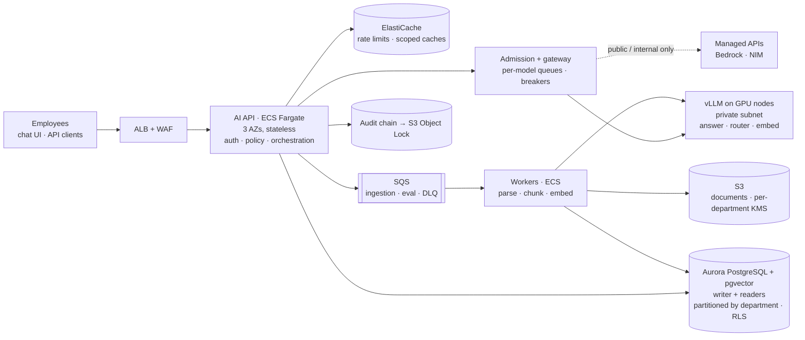

# D-60: Scale proposal — 5,000 employees, 1M documents, 100 concurrent requests (AWS)

*Decision record. System overview: [`../../README.md`](../../README.md) · engineering architecture: [`../../architecture.md`](../../architecture.md) · index: [`README.md`](README.md).*

**Target** (from the brief): 5,000 employees, 1,000,000 documents, 100 concurrent AI requests,
multiple departments, multiple providers and a GPU inference cluster. **Cloud:** AWS, the
production environment the team confirmed.

**What changes and what does not.** The system keeps its current architecture. Each tier
becomes independently elastic, and the rules that already hold in this repository stay
where they are:
- isolation in the storage layer;
- the model proposes and the backend decides;
- confidential text never leaves the VPC.

Every capacity figure below comes from [`evaluation/capacity.py`](../../evaluation/capacity.py),
and each input is labelled *measured* or *assumed*.

## Topology

## Sizing

<!-- capacity:begin -->
| Input | Value | Source | Note |
|---|---|---|---|
| Child chunks per 1,000 tokens | 18.7 | measured | production chunker on the sample corpus |
| Average document length | 2,500 tokens | assumed | ~5 pages; samples average ~290 |
| Prompt tokens per answer | 1,100 | measured | p95 of the final D5 run (mean 695) |
| Output tokens per answer | 300 | assumed | 20B-class model; the 3B model averaged 29 |
| Per-stream decode rate | 40 tok/s | assumed | fluent streaming |
| L4 decode / prefill, vLLM | 1,000 / 8,000 tok/s | assumed | planning figure; load test replaces it |
| Embedding throughput | 164/s laptop · 2,000/s L4 | measured · assumed | nomic-embed-text, batch 128 |
| Answers per employee per day | 5 | assumed |  |
| Departments | 10 | assumed | partitions of the vector tier |

| Derived | Value |
|---|---|
| Child chunks at 1M documents | ~47 M |
| Chunk table (heap) | ~142 GB |
| HNSW index, all departments | ~84 GB |
| HNSW index per department partition | ~8.4 GB |
| Answer duration at the ceiling | ~8.5 s |
| Answers/s with 100 in flight | ~11.8 |
| Answers/day expected · average rate over 8 h | 25,000 · ~0.9/s |
| Decode · prefill load at the ceiling | 4,000 · ~12,941 tok/s |
| GPUs at 60% utilisation | 10 L4 → 4 x g6.12xlarge (N+1) |
| Model tokens per day | ~35 M |
| Initial index | ~6.5 h on one L4 (~3.3 days on the laptop) |
| Daily re-index of changed documents | ~4 min on one L4 |
<!-- capacity:end -->

**What the numbers decide:**
- **The vector tier is the design constraint.** At ~84 GB, a single HNSW index cannot stay
  resident in memory on one writer. At ~8.4 GB per department it can. That is why the chunk
  tables are partitioned by department, which is also how isolation is already modelled.
  Departments are not equal in size, so the largest partition is what sets the reader
  instance size.
- **"100 concurrent" is a ceiling, not the typical load.** The expected average is ~0.9
  answers/s against ~11.8/s at the ceiling, roughly 13x lower. GPU nodes scale on queue
  depth with a floor of two, and the fleet is sized for the ceiling only during peak hours.
- **Decode dominates GPU time**: ~4 GPU-equivalents for decode against ~1.6 for prefill.
  Prompt caching of the fixed system prompt reduces prefill further, but the number of
  concurrent streams is what sizes the fleet.
- **The index is derived data.** It can be rebuilt from the documents in S3 in hours
  (6.5 h on one GPU; parallel workers make that shorter). That rebuild time is part of the
  recovery-time budget.

## Decisions, by the six concerns the brief names

In each part, **Today** means what exists and is tested in this repository, and **At scale**
means what changes.

### 1. Horizontal API scaling, asynchronous work, backpressure

**Today:**
- The API is stateless. Conversations and LangGraph checkpoints live in Postgres, so any
  process can resume any conversation, including one paused for an approval (D-26).
- Every caller has a token bucket on the routes that call a model (D-61).

**At scale:**
- **API:** ECS Fargate behind an ALB, 6–10 tasks across three AZs, scaled on in-flight
  requests rather than CPU, because the API tier waits on I/O.
- **Backpressure:** a bounded admission queue *per model*, with a maximum wait. Over that
  limit the API returns `429` with `Retry-After`; the queue never grows until requests time
  out. This is *proposed* and not built yet; the per-caller buckets are the part that exists.
- **Async work:** long-running jobs (ingestion, re-indexing, evaluation runs) go through SQS
  to a worker service. They never run inside a request.

### 2. Inference routing, GPU utilisation, batching, fallback, overload

**Today:**
- One gateway handles provider routing, retries, fallback, circuit breakers and usage
  accounting per attempt (D-10, D-11, D-14).
- Confidential context is routed only to non-egress providers (D-15).
- The router runs on its own small model (D-28). This came from a measurement: when it
  shared the answer model, every turn timed out at 60 s.

**At scale:**
- **Serving:** vLLM in a private subnet with continuous batching, and one model per node
  group: answer model, router, embeddings.
- **Autoscaling signals:** vLLM's queue depth and KV-cache use, not GPU percentage. A GPU at
  100% can still have headroom, and one at 60% can be queueing.
- **Managed APIs (Bedrock, NIM):** remain fallbacks for *public and internal* traffic only.
  The egress rule becomes a network boundary, so confidential requests have no route out of
  the VPC.
- **Overload behaviour:** see the table below.

### 3. Embedding throughput, incremental indexing, vector sharding, document lifecycle

**Today:**
- Ingestion skips documents whose content hash is unchanged (content, metadata and chunker
  version).
- A new version is swapped in atomically, so there are never duplicate active chunks (D-23).
- Failed jobs retry, then go to a dead-letter queue (D-24).

**At scale:**
- **Initial load:** the 1M documents are one batch job on spot GPU capacity (~47M chunks,
  ~6.5 h per L4, parallel across workers).
- **Steady state:** incremental, about 4 minutes of GPU time per day at 1% daily churn.
- **Storage:** `halfvec(768)` halves vector memory. It needs pgvector ≥ 0.7 on Aurora, and
  the recall cost must be measured with `evaluation/retrieval_api_eval.py` before switching.
- **Sharding:** chunk tables are partitioned by department, so each HNSW index is built and
  searched per partition and the scope filter becomes partition pruning.
- **Readers:** retrieval runs on reader endpoints; the writer is reserved for ingestion and
  actions.
- **Beyond Aurora:** if the vector tier outgrows it, the next step is a dedicated store
  (OpenSearch k-NN), and that has an explicit cost. Isolation would no longer be enforced by
  the database, so it would have to be rebuilt as an index per department plus a signed
  scope. That is why it is the second step, not the first.

### 4. Caching, invalidation, queues, retries, dead letters

**Three caches in ElastiCache, in order of increasing risk:**
1. **Embeddings:** keyed by content hash. Immutable and safe to share.
2. **Retrieval:** keyed by question hash + **scope hash** + corpus version → chunk ids.
3. **Answers:** the same key plus the model id.

**Rules:**
- **A cache key without the caller's access scope is a cross-department leak.** The scope
  is part of every key, not something added later.
- The corpus version invalidates retrieval and answer entries when a document is
  superseded, and TTLs are minutes.
- **Confidential material is never cached.**

**Queues:** SQS replaces Redis/Dramatiq, and the retry, backoff and dead-letter behaviour
carries over unchanged. A job in the dead-letter queue raises an alert and can be re-driven
by an operator once it is fixed.

### 5. Department isolation, from ingestion through retrieval, citations and audit

The design is unchanged: isolation is enforced in storage and in trusted code, never by the
prompt.

| Stage | How it is enforced |
|---|---|
| Ingestion | The department comes from the uploader's permission, never from the file (D-27). Chunks are written into that department's partition. |
| Encryption | Per-department KMS keys for S3 and backups, so "which department's data" is also a key-management question. |
| Retrieval | Row-level security under the non-superuser runtime role (D-17, D-22), plus the application filter as a second layer. |
| Model egress | Confidential context goes only to in-VPC models (D-15). |
| Citations | Citations carry the document version they were retrieved from. They are validated against what was retrieved, and re-pointed only within what was retrieved. |
| Audit | The append-only, hash-chained audit log (D-32) is exported to S3 Object Lock for retention. |

### 6. Availability, disaster recovery, observability, cost

**Availability targets:** 99.9% for answering, 99.95% for tool execution, because that is
the path with side effects.

**Disaster recovery:**
- Aurora multi-AZ with point-in-time recovery: RPO ≈ 5 minutes, RTO ≈ 30 minutes.
- An Aurora Global Database replica in a second region.
- The vector index is rebuilt from S3 if a region is lost.

**Observability:**

*Today:*
- JSON logs with correlation IDs.
- Prometheus metrics for requests, errors, latency, model calls, tokens, tool calls,
  retrieval timing and rate limiting.
- Usage rows per model attempt.
- The audit chain.

*At scale:*
- OpenTelemetry traces across API → retrieval → gateway → vLLM.
- vLLM's own metrics: queue depth, time to first token, tokens/s, KV-cache use.
- SLO alerts on time to first token and answer availability.
- **Answer-quality signals already emitted per response**, tracked as rates: abstentions,
  uncited answers, re-pointed citations. A spike in any of them is a regression signal.
- The 71-case suite runs as a release gate against staging.

**Cost:**
- GPUs scale on queue depth with a floor of two nodes, not fixed at the peak size.
- Ingestion runs on spot capacity.
- Per-department token budgets are enforced from the usage rows the gateway already writes.
  A monthly ceiling trips the same breaker as an overload.
- The cheapest token is the one prompt caching or the retrieval cache never sends.

## Overload and failure behaviour

| Situation | Behaviour | Never |
|---|---|---|
| GPU queue over its limit | Shed in order: evaluation/batch jobs → non-streaming answers → streaming answers. The shed request gets `429` + `Retry-After`. | Shed tool calls or approvals; they are the operations with side effects. |
| Local model failing | The circuit opens and public/internal traffic falls back to a managed API (D-11). Confidential traffic falls back to a smaller local model. | Send confidential context to a managed API. |
| All generation unavailable | Retrieval-only response: the cited passages, with no generated prose. | Answer without a source. |
| Aurora writer lost | Failover within the RTO. Answering continues from readers; tools are refused, not queued. | Execute an action whose audit record cannot be written. |
| Ingestion backlog | The SQS queue absorbs it; after retries a job goes to the dead-letter queue and raises an alert. The previous document version stays active. | Serve a half-indexed document. |
| Department over budget | That department is throttled; others are unaffected. | Let one department's spend degrade another's service. |

## Alternatives considered

- **Managed inference only (Bedrock), no GPU cluster.** Simpler to run, but confidential
  text would leave the VPC. The team lead confirmed that is not allowed. It stays as the
  fallback for public and internal traffic.
- **A dedicated vector database from day one.** Better raw scale, but isolation would move
  out of the database layer. That is deferred until the partitioned pgvector tier is
  measured to be insufficient.
- **One cluster per department.** The strongest isolation, but ~10x the fixed cost and an
  operating burden. Partitions, RLS and per-department keys give the same guarantee at the
  storage layer.

## What this proposal does not claim

None of this has been load-tested. The inputs marked *assumed* are planning figures, and the
*measured* ones come from single requests on a laptop. The first work at real scale is a
load test that replaces the assumptions, in this order:

1. pgvector recall and p95 latency on one ~8 GB department partition, `halfvec` vs `vector`;
2. vLLM decode and prefill tokens/s on the chosen answer model under continuous batching;
3. the admission limit at which answer p95 stops being flat.

Changing any input and running `python -m evaluation.capacity` regenerates the tables above.
`tests/unit/test_capacity.py` fails if this document quotes numbers the model no longer
produces.
