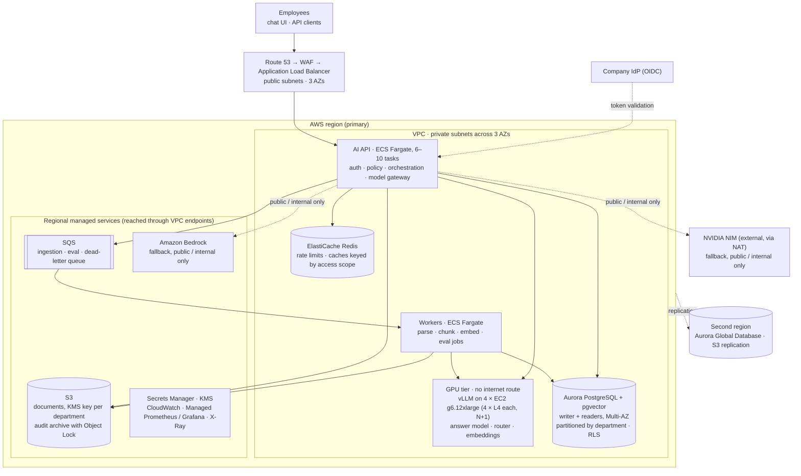

# D-60: Scale proposal — 5,000 employees, 1M documents, 100 concurrent requests (AWS)

*Decision record. System overview: [`../../README.md`](../../README.md) · engineering architecture: [`../../architecture.md`](../../architecture.md) · index: [`README.md`](README.md).*

**Target** (from the brief): 5,000 employees, 1,000,000 documents, 100 concurrent AI requests,
several departments and providers, a GPU inference cluster. **Cloud:** AWS.

**The short version:**
- **Same architecture.** Each tier becomes independently scalable.
- **Same rules.** Isolation is enforced in the database, the backend decides what runs, and
  confidential text never leaves the VPC.
- **One change the numbers force:** the vector store is partitioned by department.

*Terms:* a **chunk** is the small passage (~64 tokens) that is embedded and searched. A
**section** is the larger passage (~256 tokens) the model reads. Every number below comes
from [`evaluation/capacity.py`](../../evaluation/capacity.py).

## AWS architecture

Text version of the diagram (Mermaid)

**A question's path:**
1. The ALB routes the request to an API task, which checks the token and loads the caller's
   permissions from Aurora.
2. Retrieval runs on an Aurora reader, only in the caller's department partitions, under
   row-level security.
3. The answer is generated by vLLM inside the VPC. Bedrock or NIM are used only if the
   context is public or internal *and* the local model is failing.
4. Citations are checked against what was retrieved. Usage and audit records are written
   to Aurora, and the audit chain is archived to S3 Object Lock.

**A document's path:** upload to S3 (encrypted with the department's key) → SQS → worker
parses, chunks and embeds it on the GPU nodes → the new version is swapped into the
department's partition in one step → failed jobs retry, then land in the dead-letter queue.

## Sizing

<!-- capacity:begin -->
| Input | Value | Source | Note |
|---|---|---|---|
| Search chunks per 1,000 tokens | 18.7 | measured | production chunker on the sample corpus |
| Average document length | 2,500 tokens | assumed | ~5 pages; samples average ~290 |
| Prompt tokens per answer | 1,100 | measured | p95 of the final D5 run (mean 695) |
| Output tokens per answer | 300 | assumed | 20B-class model; the 3B model averaged 29 |
| Per-stream decode rate | 40 tok/s | assumed | fluent streaming |
| L4 decode / prefill, vLLM | 1,000 / 8,000 tok/s | assumed | planning figure; load test replaces it |
| Embedding throughput | 164/s laptop · 2,000/s L4 | measured · assumed | nomic-embed-text, batch 128 |
| Answers per employee per day | 5 | assumed |  |
| Departments | 10 | assumed | partitions of the vector tier |

| Derived | Value |
|---|---|
| Search chunks at 1M documents | ~47 M |
| Chunk table (heap) | ~142 GB |
| HNSW index, all departments | ~84 GB |
| HNSW index per department partition | ~8.4 GB |
| Answer duration at the ceiling | ~8.5 s |
| Answers/s with 100 in flight | ~11.8 |
| Answers/day expected · average rate over 8 h | 25,000 · ~0.9/s |
| Decode · prefill load at the ceiling | 4,000 · ~12,941 tok/s |
| GPUs at 60% utilisation | 10 L4 → 4 x g6.12xlarge (N+1) |
| Model tokens per day | ~35 M |
| Initial index | ~6.5 h on one L4 (~3.3 days on the laptop) |
| Daily re-index of changed documents | ~4 min on one L4 |
<!-- capacity:end -->

**What the numbers decide:**
1. **Partition the vector store by department.** One ~84 GB index does not stay in memory
   on a single database; ~8.4 GB per department does. It also matches how isolation already
   works.
2. **Scale GPUs on queue length, with a floor of two nodes.** "100 concurrent" is the peak.
   Average load is ~13× lower, so the fleet is not kept at peak size all day.
3. **Treat the index as rebuildable.** It can be rebuilt from S3 in hours, and that rebuild
   time is part of the recovery budget.

## The six concerns

**Today** means built and tested in this repository. **At scale** means what changes.

| Concern | Today | At scale |
|---|---|---|
| API scaling, async work, backpressure | Stateless API; state in Postgres, so any process resumes any conversation, including a paused approval (D-26). Token bucket per caller (D-61). | ECS Fargate across 3 AZs, scaled on in-flight requests. A **bounded queue per model**, returning `429` + `Retry-After` when full (*proposed*). Long jobs go through SQS, never inside a request. |
| Inference routing, GPU use, batching, fallback, overload | Gateway with retries, fallback, circuit breakers and per-attempt usage (D-10, D-11, D-14). Router on its own small model (D-28). | vLLM with continuous batching, one model per node group. Autoscale on vLLM queue depth and KV-cache use, not GPU %. Managed APIs are fallback for public/internal only. |
| Embeddings, incremental indexing, sharding, document lifecycle | Unchanged documents skipped by content hash. New versions swapped in atomically (D-23). Retries and dead-letter queue (D-24). | Initial load as one GPU batch job on spot capacity (~6.5 h per L4). Then ~4 min/day. `halfvec` vectors (pgvector ≥ 0.7; measure recall first). Partitions per department. Retrieval on readers. |
| Caching, invalidation, queues, retries, DLQ | — | Embedding, retrieval and answer caches whose **key always includes the caller's access scope**; a key without it is a cross-department leak. The corpus version invalidates entries. Confidential data is never cached. SQS keeps today's retry and dead-letter rules. |
| Isolation from ingestion to audit | Department taken from the uploader's permission (D-27). RLS plus an application filter (D-17, D-22). Confidential context sent only to local models (D-15). Hash-chained audit log (D-32). | Adds a KMS key per department and the audit archive in S3 Object Lock. Confidential requests have no network route out of the VPC. |
| Availability, DR, observability, cost | JSON logs with correlation IDs. Prometheus metrics for requests, errors, latency, model and tool calls, retrieval time. Usage rows per model call. | **Availability:** 99.9% for answers, 99.95% for tools. **DR:** RPO ≈ 5 min, RTO ≈ 30 min, second region via Aurora Global Database. **Observability:** OpenTelemetry traces (*proposed*); abstention, uncited and re-pointed rates tracked as quality alarms; the 71-case suite as a release gate. **Cost:** a token budget per department. |

## Under overload: what never happens

| Situation | Behaviour | Never |
|---|---|---|
| GPU queue full | Shed evaluation jobs first, then non-streaming answers, then streaming answers. | Drop a tool call or an approval. |
| Local model failing | Public/internal traffic falls back to Bedrock or NIM. Confidential traffic falls back to a smaller local model. | Send confidential text outside the VPC. |
| No model can generate | Return the cited passages without generated prose. | Answer without a source. |
| Database writer down | Answers continue from readers; tools are refused. | Run an action whose audit record cannot be written. |
| Department over budget | Only that department is throttled. | Let one department slow down another. |

## Alternatives rejected

- **Managed inference only (Bedrock, no GPUs):** confidential text would leave the VPC.
- **A dedicated vector database from day one:** isolation would move out of the database.
  Deferred until partitioned pgvector is measured as too slow.
- **One cluster per department:** the same guarantee at ~10× the cost.

## What this does not claim

Nothing here is load-tested. Values marked *assumed* are planning figures. The first work
at real scale is to measure:

1. pgvector recall and latency on one ~8 GB partition;
2. vLLM throughput on the chosen model;
3. the load at which p95 latency starts to rise.

Change an input and run `make capacity` to regenerate the tables.
`tests/unit/test_capacity.py` fails if this page quotes a number the model no longer
produces.
