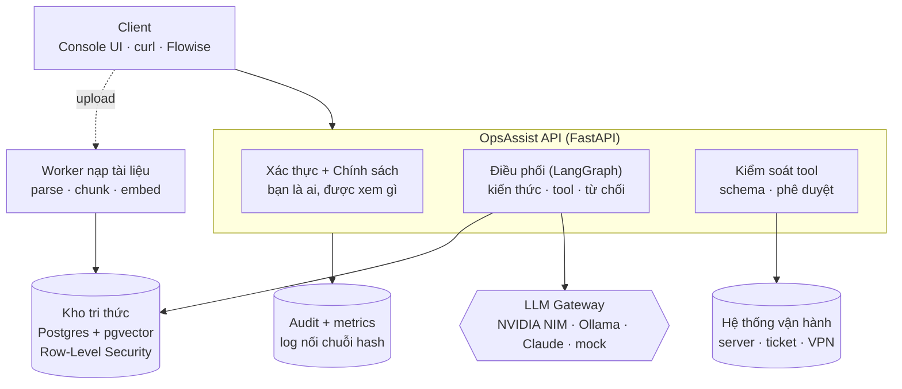

# OpsAssist — Trợ lý vận hành AI nội bộ

*Tài liệu trình bày cho hội đồng · cập nhật tối 23/09/2026 (ngày 5/6) · review 29/09/2026*

---

## 1. Dự án là gì?

OpsAssist là trợ lý nội bộ cho nhân viên, làm **hai việc**:

1. **Trả lời câu hỏi từ tài liệu công ty** — chỉ dùng tài liệu *người hỏi được phép đọc*, và luôn **kèm trích dẫn** (tài liệu, phiên bản, mục, đoạn).
2. **Thực hiện một số thao tác vận hành đã được duyệt** — xem trạng thái server, tạo/xem ticket, yêu cầu cấp VPN (VPN cần **hai người**: một người yêu cầu, một người duyệt).

**Nguyên tắc cốt lõi:** *mô hình đề xuất, backend quyết định.*
Xác thực, phân quyền, cách ly dữ liệu, phê duyệt và nhật ký kiểm toán đều được thực thi **trong code và trong database** — không bao giờ dựa vào việc "dặn" mô hình qua prompt.

### Ví dụ nhanh

| Người hỏi | Câu hỏi | Kết quả |
|---|---|---|
| Aisha (Engineering) | "Khung giờ deploy production là khi nào?" | Trả lời + trích dẫn `KB-ENG-001` |
| Aisha (Engineering) | "Lương thưởng HR năm nay thế nào?" | Không thấy gì — tài liệu HR bị chặn ở tầng database |
| Mei Lin (HR, không có quyền server) | "Kiểm tra server api-01" | Bị từ chối **trước khi** tool chạy |
| Priya (IT, có `vpn:create`) | "Tạo VPN cho tôi" | Chỉ tạo *đề xuất*, chờ người có `vpn:approve` duyệt |

---

## 2. Kiến trúc



### Luồng một câu hỏi (5 bước)

1. **Xác thực**: JWT gắn với user + role; quyền luôn đọc lại từ database.
2. **Định tuyến**: một mô hình nhỏ chạy local phân loại câu hỏi → *chào hỏi / tra cứu kiến thức / gọi tool / từ chối*.
3. **Tra cứu**: tìm kiếm lai (vector + full-text) **đã lọc theo phòng ban và mức mật** — lọc 2 lớp: câu SQL **và** Row-Level Security của Postgres.
4. **Sinh câu trả lời**: qua Gateway (có retry, fallback, circuit breaker). Tài liệu *confidential* chỉ được gửi tới mô hình chạy nội bộ, không ra ngoài.
5. **Kiểm tra trích dẫn + ghi audit**: trích dẫn nào không trỏ tới nguồn đã truy xuất thì bị loại; mọi hành động ghi vào log nối chuỗi hash (không sửa/xoá được).

### Các quyết định lớn

| Vấn đề | Chọn | Thay vì | Lý do |
|---|---|---|---|
| Lưu vector | pgvector trong Postgres chính | Qdrant, Weaviate | Quyền, phiên bản, vector nằm chung một transaction; RLS bảo vệ luôn cả truy xuất |
| Cách ly phòng ban | Lọc SQL **+** RLS | Chỉ lọc trong code | Quên lọc ở code thì DB vẫn trả về rỗng |
| Chia nhỏ tài liệu | Parent-child (khớp đoạn nhỏ, đưa cả mục cho mô hình) | Theo trang, cửa sổ cố định, Docling | **Đo được**: tốt nhất trên bộ 41 câu hỏi vàng |
| Điều phối | LangGraph + checkpoint Postgres | Tự viết state machine | Tạm dừng chờ phê duyệt VPN, sống sót qua restart |
| Gọi mô hình | Gateway tự xây | LiteLLM | Fallback, luật dữ liệu ra ngoài, đếm token — tự kiểm soát và giải thích được |
| Mô hình định tuyến | Mô hình nhỏ local riêng | Dùng chung mô hình trả lời | **Đo được**: NIM timeout 60s → mọi lượt âm thầm rơi về chế độ tra cứu |

Toàn bộ **35 quyết định** (kèm phương án đã cân nhắc và số đo) nằm trong `docs/decisions/`.

---

## 3. Cấu trúc code

```
src/opsassist/
├── main.py, config.py        # khởi tạo app, cấu hình
├── auth.py, middleware.py    # JWT, request ID, logging
├── ratelimit.py              # giới hạn tần suất theo người gọi (token bucket)
├── gateway/                  # LLM Gateway: định tuyến, retry, fallback, circuit breaker
├── providers/                # adapter: NIM (OpenAI-compatible), Ollama, Claude, mock
├── knowledge/                # tri thức: parsing → chunking → ingest → retrieval → upload
├── rag.py                    # dựng prompt, kiểm tra trích dẫn, từ chối khi không có nguồn
├── agent/                    # LangGraph: đồ thị định tuyến, checkpoint, dịch vụ agent
├── tools/                    # 5 tool có schema kiểu chặt + bộ thực thi
├── policy/                   # quyền truy cập (access.py) + audit nối chuỗi hash
├── memory.py                 # bộ nhớ lâu dài: chỉ lưu các khóa trong allowlist
├── api/                      # các endpoint: chat, search, actions, tickets, memory, audit...
├── db/                       # SQLAlchemy models, session
└── worker.py                 # worker Dramatiq nạp tài liệu (retry + dead-letter)

migrations/        # 8 migration Alembic (gồm role DB không phải superuser, RLS)
sample_data/       # 11 tài liệu mẫu (md, txt, pdf) + 6 nhân viên mẫu
evaluation/        # bộ đánh giá 71 ca + LLM judge + so sánh chiến lược chunking
tests/             # unit + integration
web/index.html     # console thử nghiệm (chỉ dùng dev)
docs/              # quyết định kiến trúc (D-xx), bảng truy vết yêu cầu
```

**Stack:** Python 3.12 · FastAPI · Postgres + pgvector · Redis · Dramatiq · LangGraph · Docker Compose.
**Mô hình:** NVIDIA NIM `gpt-oss-20b` (mặc định) · Ollama `llama3.2:3b` (local) · Claude (tắt tới khi có API key) · mock (cho CI). Embedding: `nomic-embed-text` chạy local.

---

## 4. Cách chạy

```bash
cp .env.example .env                        # cấu hình mặc định, không cần API key
ollama pull nomic-embed-text llama3.2:3b    # mô hình local
make up                                     # build, migrate, seed, chờ healthy
make ingest                                 # nạp tài liệu mẫu
make ui                                     # mở console: http://localhost:8000/ui
```

| Lệnh | Việc |
|---|---|
| `make test` | Unit test, không cần dịch vụ |
| `make test-integration` | Integration test trên stack đang chạy |
| `make test-security` | Test bảo mật: phân quyền, cách ly, injection, audit, egress |
| `make eval` | Bộ đánh giá 71 ca có LLM judge (cần `ollama pull qwen2.5:7b`) |
| `make eval-control` | Như trên + đường cơ sở "không truy xuất" để so sánh |

---

## 5. Kết quả đến hiện tại

### Tiến độ theo ngày

| Ngày | Nội dung | Trạng thái |
|---|---|---|
| D1 | Nền tảng: API, DB, health check, CI | ✅ đã merge |
| D2 | Task 1 — LLM Gateway, nhiều provider, fallback | ✅ PR #1 |
| D3 | Task 2 — RAG có cách ly phòng ban + đánh giá chunking | ✅ PR #2–#5 |
| D4 | Task 3+4 — Tool, phê duyệt 2 người, audit, bộ nhớ, upload, rate limit | ✅ PR #6 |
| D5 | Task 5 — Bộ đánh giá 71 ca, LLM judge, PDF bố cục phức tạp; sửa đọc bảng PDF, trích dẫn, trả lời một phần, gán nguồn | 🟡 PR #7 → #8 → #9 chờ review; kết quả đã đóng băng |
| D6 | Đề xuất mở rộng trên AWS + chuẩn bị trình bày | 🟡 đề xuất đã viết (D-60) |

### Kiểm thử

- **184 unit test + 63 integration test** đều pass; lint + mypy (strict) sạch.

### Đánh giá 71 ca (trả lời bằng `llama3.2:3b`, chấm bằng `qwen2.5:7b`)

| Tiêu chí | Kết quả |
|---|---|
| **Cách ly phòng ban** | **10/10** — không rò rỉ tài liệu nào |
| **Độ chính xác tool** (chọn đúng tool, tham số, phân quyền) | **30/30** |
| **Từ chối đúng lúc** (không có nguồn / không có quyền) | **12/12** |
| Trích dẫn hợp lệ (trỏ đúng nguồn đã truy xuất) | 38/38 |
| Trích dẫn đúng tài liệu mong đợi (câu trả lời không có trích dẫn tính là sai) | 36/37 |
| Trích dẫn thật sự hỗ trợ câu văn (LLM judge chấm từng trích dẫn) | 32/38 = 0.84 |
| Dữ kiện tham chiếu được nêu đúng | 34/39 = 0.87 |
| Trả lời đúng hoàn toàn | **64/71** (chấm tay: **67/71**) |
| Truy xuất: Hit@1 · MRR (41 câu vàng, tìm kiếm lai) | 0.927 · 0.963 |
| Độ trễ p50 / p95 (mô hình 3B chạy trên laptop, dao động theo tải máy) | 1.0–3.2 s / 2.3–5.0 s |

**So với mô hình không có RAG** (cùng mô hình, không truy xuất, không phân quyền): chỉ đúng **16%** dữ kiện (so với **87%** qua hệ thống), không có trích dẫn, và trả lời **5/5** câu mà người hỏi không có quyền hỏi.

**Điểm quan trọng:** mọi tiêu chí *an toàn* (cách ly, phân quyền, phê duyệt) đạt 100% và được chấm **bằng luật, không dùng mô hình**. LLM judge chỉ chấm chất lượng câu văn.

**Vì sao "chấm tay" cao hơn?** Điểm 64/71 do code đánh giá tự tính, không chỉnh tay ca nào. Đọc từng ca trong 7 ca trượt: **4 lỗi thật** (K08, M02, M01, M04), **2 lỗi của judge** (M03, M05: câu trả lời đúng nhưng judge chấm sai), **1 bộ lọc bắt nhầm** (E10: câu phủ định đúng "không xác nhận có trừ tiền trùng" chứa đúng cụm từ bị cấm). Mọi ca trượt đều in nguyên câu trả lời để người đọc tự kiểm tra.

### Bốn lỗi đã sửa hôm nay (ví dụ về cách làm việc)

**1. Đọc nhầm dòng bảng trong PDF (ca L04).**
- Hỏi "Tier 2 phải phản hồi SEV1 trong bao lâu?" → trả lời *30 phút* (sai, đúng là *10 phút*). Bảng trong PDF bị trích thành chuỗi phẳng, mô hình 3B đọc nhầm dòng.
- Sửa: parser đọc toạ độ ô trong PDF, viết lại mỗi dòng kèm nhãn cột: `Tier 2 - platform (SEV1): Hours = 24/7; Acknowledge within = 10 minutes; ...`
- Kết quả: đúng 3/3 lần; câu hỏi đối chứng về dòng bên cạnh vẫn đúng (30 phút); truy xuất không giảm (Hit@1 0.878 → 0.927).

**2. Câu trả lời đúng nhưng không có trích dẫn** (phát hiện khi thử vai HR trên console).
- Mô hình viết "according to source 1" thay vì `[1]`, nên hệ thống không nhận ra trích dẫn.
- Sửa: tự chuyển "source 1" → `[1]`; console hiện nhãn đỏ **uncited** nếu vẫn không có trích dẫn.
- Bộ đánh giá cũng có đúng điểm mù này (câu không trích dẫn vẫn được tính đạt) → đã sửa, giờ tính là trượt.

**3. Câu hỏi hai phần bị từ chối cả câu.**
- "Nhân viên có bao nhiêu ngày phép năm và phép ốm?" → từ chối, vì tài liệu không có chính sách phép ốm.
- Thử 4 cách viết prompt trên dữ liệu thật; chọn cách cho kết quả đúng 5/6: *"14 ngày phép năm [1]. Tài liệu không đề cập phép ốm."*
- **Cái giá:** mô hình 3B đôi khi thêm câu "nguồn không đề cập…" vào câu hỏi đã trả lời đủ. Đã ghi rõ trong báo cáo, không giấu.

**4. Dữ kiện đúng nhưng gán nhầm nguồn (ca L03).**
- Hỏi "Khi nào payment-worker được scale?" → trả lời đúng (*hàng đợi trên 5.000*) nhưng trích dẫn ghi chú sự cố, trong khi chỉ bảng giá năng lực [1] có con số 5.000.
- Sửa: sau khi mô hình trả lời, backend so các con số trong từng câu với nguồn được trích; nếu con số không có trong nguồn đó mà có trong nguồn khác đã truy xuất → chuyển trích dẫn sang nguồn đúng. Không cần gọi thêm mô hình, và báo cáo đếm số lần chỉnh để không có sửa "ngầm".
- Kết quả: L03 trích đúng nguồn 6/6 lần; các câu khác không bị đụng tới.

### Hạn chế — nói thẳng (phương pháp đã đóng băng, các điểm này được ghi nhận chứ không tối ưu thêm)

- **Gán nguồn chỉ được kiểm tra với câu có con số:** câu không có số vẫn có thể bị gán nhầm nguồn (vẫn là nguồn người dùng được phép xem — không rò rỉ).
- **Câu "nguồn không đề cập…" thừa:** thường vô hại, nhưng ở K08 nó sai (nói nguồn không đề cập điều mà câu trước vừa trả lời).
- **Câu trả lời có thể thiếu trích dẫn (M02):** console gắn nhãn **uncited** và bộ đánh giá tính là trượt, nhưng hệ thống chưa chặn.
- **Tiền đề sai:** đôi khi từ chối thay vì đính chính ("sự cố kéo dài 3 giờ…" → nên trả lời "thực tế là 18 phút").
- **Mô hình 3B là mức sàn:** các con số trên là cận dưới; gateway có thể chuyển sang mô hình lớn hơn mà không đổi code.
- **SSO thật chưa có:** dùng bộ phát token dev thay cho IdP công ty.
- **AWS mới thiết kế, chưa triển khai;** số liệu mở rộng suy ra từ đo đạc thực tế, chưa load test.

---

## 6. Đề xuất mở rộng (AWS) — tóm tắt

Mục tiêu: **5.000 nhân viên, 1 triệu tài liệu, 100 request đồng thời.**

- **Tính toán:** ECS/EKS, mỗi tầng scale độc lập.
- **Dữ liệu:** Aurora PostgreSQL + pgvector (~140 GB index vector ở 1M tài liệu → phải phân vùng).
- **Hàng đợi / cache:** SQS + ElastiCache; tài liệu upload lưu S3.
- **Bảo mật:** Secrets Manager + KMS; **tài liệu confidential chỉ đi tới vLLM tự host trong VPC.**

Chi tiết: `docs/decisions/D-60-scale-proposal-aws.md`.

---

## 7. Tài liệu tham khảo

| File | Nội dung |
|---|---|
| `README.md` | Tổng quan hệ thống, demo 6 hạng mục bắt buộc |
| `architecture.md` | Kiến trúc kỹ thuật chi tiết |
| `docs/decisions/` | 35 bản ghi quyết định |
| `docs/traceability.md` | Truy vết từng yêu cầu → code → test |
| `evaluation/reports/evaluation.md` | Báo cáo đánh giá sinh tự động |
| `evaluation/reports/analysis.md` | Phân tích tay từng ca lỗi |
