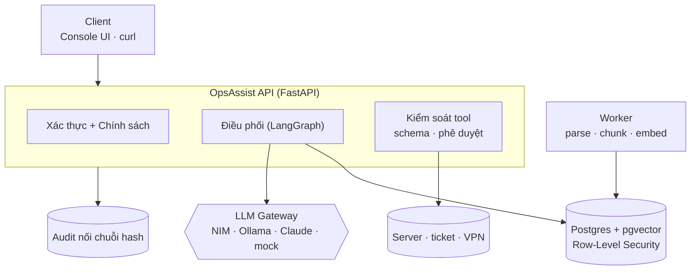

# OpsAssist — Trợ lý vận hành AI nội bộ

*Tài liệu trình bày cho hội đồng · cập nhật 24/09/2026 · review 29/09/2026*

---

## 1. Dự án là gì?

Trợ lý nội bộ cho nhân viên, làm **hai việc**:

1. **Trả lời câu hỏi từ tài liệu công ty.** Chỉ dùng tài liệu *người hỏi được phép đọc*, và luôn có trích dẫn.
2. **Thực hiện thao tác vận hành đã được duyệt:** xem server, tạo/xem ticket, cấp VPN. Cấp VPN cần **hai người**, một người yêu cầu và một người duyệt.

**Nguyên tắc:** *mô hình đề xuất, backend quyết định.* Phân quyền, cách ly dữ liệu, phê duyệt và audit đều nằm **trong code và database**, không dựa vào prompt.

| Người hỏi | Câu hỏi | Kết quả |
|---|---|---|
| Aisha (Engineering) | "Khung giờ deploy production?" | Trả lời + trích dẫn `KB-ENG-001` |
| Aisha (Engineering) | "Ghi chú lương thưởng HR?" | Không thấy gì: tài liệu HR bị chặn ở database |
| Mei Lin (HR) | "Kiểm tra server api-01" | Bị từ chối **trước khi** tool chạy |
| Priya (IT) | "Tạo VPN cho tôi" | Chỉ tạo *đề xuất*, chờ người có quyền duyệt |

---

## 2. Kiến trúc



**Một câu hỏi đi qua 5 bước:**
1. **Xác thực:** quyền luôn đọc lại từ database.
2. **Định tuyến:** mô hình nhỏ chạy local chọn *trả lời từ tài liệu / gọi tool / từ chối*.
3. **Tra cứu:** tìm kiếm lai, **đã lọc theo phòng ban và mức bảo mật** ở 2 lớp: câu SQL và Row-Level Security (RLS) của Postgres.
4. **Sinh câu trả lời:** qua Gateway (retry, fallback, circuit breaker). Tài liệu *confidential* chỉ gửi tới mô hình nội bộ.
5. **Kiểm tra trích dẫn và ghi audit:** trích dẫn phải trỏ đúng nguồn đã truy xuất; mọi hành động ghi vào log không sửa được.

**Quyết định chính** (đầy đủ 35 quyết định trong `docs/decisions/`):

| Vấn đề | Chọn | Lý do |
|---|---|---|
| Lưu vector | pgvector trong Postgres | Quyền, phiên bản và vector nằm chung một transaction; RLS bảo vệ cả truy xuất |
| Cách ly phòng ban | Lọc SQL **+** RLS | Code quên lọc thì database vẫn chặn |
| Chia tài liệu | Parent–child | **Đo được:** tốt nhất trên 41 câu hỏi vàng |
| Điều phối | LangGraph + checkpoint | Tạm dừng chờ duyệt VPN, không mất trạng thái khi restart |
| Mô hình định tuyến | Mô hình nhỏ local riêng | **Đo được:** dùng chung với NIM thì timeout 60s |

---

## 3. Code và cách chạy

```
src/opsassist/   gateway/ providers/   → gọi mô hình, fallback
                 knowledge/ rag.py     → nạp tài liệu, tra cứu, trích dẫn
                 agent/ tools/         → LangGraph, 5 tool có schema
                 policy/ api/          → phân quyền, audit, endpoint
evaluation/      bộ đánh giá 71 ca, LLM judge, mô hình tính công suất
tests/           unit · integration · security
```

```bash
cp .env.example .env && ollama pull nomic-embed-text llama3.2:3b
make up && make ingest     # chạy stack, nạp tài liệu mẫu
make ui                    # console: http://localhost:8000/ui
make test-security         # 105 test bảo mật
make eval                  # bộ đánh giá 71 ca
```

**Kiểm thử:** 188 unit, 63 integration, 105 security, tất cả pass; lint + mypy (strict) sạch.

---

## 4. Kết quả đánh giá

71 ca kiểm thử, mỗi ca là một nhân viên hỏi một câu, trải đủ 8 nhóm đề bài yêu cầu. Lần chạy cuối được làm từ trạng thái sạch (xoá database, build lại, nạp lại tài liệu mẫu), nên tái lập được. Mô hình trả lời là `llama3.2:3b`, mô hình chấm là `qwen2.5:7b` (khác họ mô hình, chạy local).

**Hai cách chấm:**
- **Bằng luật, chính xác tuyệt đối:** phân quyền, cách ly, gọi tool, từ chối.
- **Bằng LLM judge:** chỉ chấm chất lượng câu văn.

Điểm do code tự tính, không chỉnh tay ca nào.

```text
Strict correctness:        63/71 (88.7%)
Manual review:              66/71 (93.0%)

Isolation:                  10/10
Tool accuracy:              30/30
Abstention:                 12/12
Citation validity:          36/36
Exact citation support:     35/35
```

| Tiêu chí (theo đề bài) | Kết quả |
|---|---|
| **Trả lời đúng** | 63/71 ca đúng hoàn toàn (88,7%), 66/71 khi chấm tay · dữ kiện tham chiếu được nêu đúng 34/39 (87%) |
| **Truy xuất đúng tài liệu** | nguồn đúng nằm trong top-4: 37/39 (94,9%) · MRR 0,923 |
| **Trích dẫn đúng** | trích dẫn hợp lệ 36/36 · hỗ trợ đúng câu văn 35/35 · trích đúng tài liệu mong đợi 36/37 |
| **Chống bịa đặt (hallucination)** | bộ lọc cụm từ cấm 28/29 (lần trượt là một câu từ chối đúng) · từ chối đúng lúc 12/12 |
| **Gọi tool** | 30/30 (đúng tool, đúng tham số, đúng phân quyền và xác nhận) |
| **Cách ly phòng ban** | 10/10, không rò rỉ tài liệu nào |
| **Hiệu năng · chi phí** | p50 1,1 s / p95 4,5 s · ~490 token mỗi ca · $0 (mô hình chạy local) |

**So với cùng mô hình nhưng không có RAG:**

| | Không có RAG | Có hệ thống |
|---|---|---|
| Dữ kiện đúng | 16% | 87% |
| Trích dẫn | không có | có |
| Câu người hỏi không có quyền hỏi | trả lời 5/5 | không trả lời |

---

## 5. Đề xuất mở rộng trên AWS (D6)

Mục tiêu: **5.000 nhân viên, 1 triệu tài liệu, 100 request đồng thời**, có cụm GPU. Kiến trúc giữ nguyên, từng tầng scale riêng. Sơ đồ AWS đầy đủ nằm trong `docs/decisions/D-60-scale-proposal-aws.md`.

Số liệu do `evaluation/capacity.py` tính ra (`make capacity`). Mỗi đầu vào ghi rõ **đo được** hay **giả định**.

| Kết quả | Giá trị |
|---|---|
| Chunk ở 1 triệu tài liệu | ~47 triệu |
| Index vector: toàn bộ · mỗi phòng ban | ~84 GB · ~8,4 GB |
| GPU ở mức trần | 10 GPU L4 → 4 máy g6.12xlarge (dư 1 máy) |
| Tải trần · tải trung bình | ~11,8 · ~0,9 câu trả lời/giây |
| Index lần đầu · hằng ngày | ~6,5 giờ · ~4 phút |

**Ba quyết định mà con số buộc phải có:**
1. **Chia vector theo phòng ban:** 84 GB không vừa RAM một máy, nhưng 8,4 GB thì vừa. Việc chia này cũng khớp với mô hình cách ly.
2. **GPU scale theo hàng đợi, tối thiểu 2 máy:** tải thường thấp hơn mức trần ~13 lần.
3. **Index dựng lại được từ S3 trong vài giờ:** thời gian này được tính vào kế hoạch khôi phục.

**Không bao giờ:** bỏ lệnh gọi tool hay phê duyệt khi quá tải; gửi dữ liệu confidential ra ngoài VPC; trả lời mà không có nguồn.

---

## 6. Hạn chế — nói thẳng

- **Tiền đề sai:** đôi khi từ chối hoặc chỉ nói "không đề cập" thay vì đính chính.
- **Trích dẫn:**
  - câu trả lời có thể thiếu trích dẫn (hệ thống gắn nhãn *uncited*, nhưng chưa chặn);
  - gán nguồn chỉ được kiểm tra với câu có con số;
  - đôi khi thêm câu "nguồn không đề cập…" không cần thiết, có lúc sai.
- **Mô hình 3B là mức sàn:** các con số là cận dưới; gateway có thể chuyển sang mô hình lớn hơn mà không đổi code.
- **Chưa có SSO thật:** dùng token dev thay cho IdP công ty.
- **AWS mới thiết kế, chưa triển khai và chưa load test.**

**Tài liệu:**
- `README.md`: tổng quan và demo;
- `architecture.md`: kiến trúc;
- `docs/decisions/`: 35 quyết định;
- `evaluation/reports/analysis.md`: phân tích từng ca lỗi.
