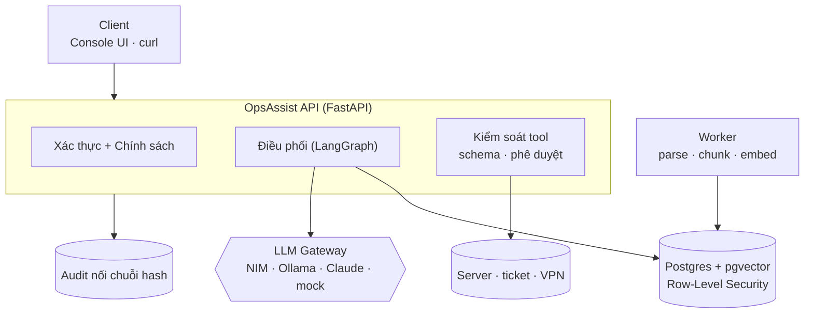

# OpsAssist — Trợ lý vận hành AI nội bộ

*Tài liệu trình bày cho hội đồng · cập nhật 24/09/2026 · review 29/09/2026*

---

## 1. Dự án là gì?

Trợ lý nội bộ cho nhân viên, làm **hai việc**:

1. **Trả lời câu hỏi từ tài liệu công ty.** Chỉ dùng tài liệu *người hỏi được phép đọc*, và luôn có trích dẫn.
2. **Thực hiện thao tác vận hành đã được duyệt:** xem server, tạo/xem ticket, cấp VPN. Cấp VPN cần **hai người**, một người yêu cầu và một người duyệt.

**Nguyên tắc:** *mô hình đề xuất, backend quyết định.* Phân quyền, cách ly dữ liệu, phê duyệt và audit đều nằm **trong code và database**, không dựa vào prompt.

| Người hỏi | Câu hỏi | Kết quả |
|---|---|---|
| Aisha (Engineering) | "Khung giờ deploy production?" | Trả lời + trích dẫn `KB-ENG-001` |
| Aisha (Engineering) | "Ghi chú lương thưởng HR?" | Không thấy gì: tài liệu HR bị chặn ở database |
| Mei Lin (HR) | "Kiểm tra server api-01" | Bị từ chối **trước khi** tool chạy |
| Priya (IT) | "Tạo VPN cho tôi" | Chỉ tạo *đề xuất*, chờ người có quyền duyệt |

---

## 2. Kiến trúc


```mermaid
flowchart TB
  client["Client<br/>Console UI · curl"]
  subgraph api["OpsAssist API (FastAPI)"]
    direction LR
    authz["Xác thực + Chính sách"]
    agent["Điều phối (LangGraph)"]
    tools["Kiểm soát tool<br/>schema · phê duyệt"]
  end
  kb[("Postgres + pgvector<br/>Row-Level Security")]
  ops[("Server · ticket · VPN")]
  llm{{"LLM Gateway<br/>NIM · Ollama · Claude · mock"}}
  audit[("Audit nối chuỗi hash")]
  worker["Worker<br/>parse · chunk · embed"]

  client --> api
  agent --> kb
  tools --> ops
  agent --> llm
  api --> audit
  worker --> kb
```

**Một câu hỏi đi qua 5 bước:**
1. **Xác thực:** quyền luôn đọc lại từ database.
2. **Định tuyến:** mô hình nhỏ chạy local chọn *trả lời từ tài liệu / gọi tool / từ chối*.
3. **Tra cứu:** tìm kiếm lai, **đã lọc theo phòng ban và mức bảo mật** ở 2 lớp: câu SQL và Row-Level Security (RLS) của Postgres.
4. **Sinh câu trả lời:** qua Gateway (retry, fallback, circuit breaker). Tài liệu *confidential* chỉ gửi tới mô hình nội bộ.
5. **Kiểm tra trích dẫn và ghi audit:** trích dẫn phải trỏ đúng nguồn đã truy xuất; mọi hành động ghi vào log không sửa được.

**Quyết định chính** (đầy đủ 35 quyết định trong `docs/decisions/`):

| Vấn đề | Chọn | Lý do |
|---|---|---|
| Lưu vector | pgvector trong Postgres | Quyền, phiên bản và vector nằm chung một transaction; RLS bảo vệ cả truy xuất |
| Cách ly phòng ban | Lọc SQL **+** RLS | Code quên lọc thì database vẫn chặn |
| Chia tài liệu | Parent–child | **Đo được:** tốt nhất trên 41 câu hỏi vàng |
| Điều phối | LangGraph + checkpoint | Tạm dừng chờ duyệt VPN, không mất trạng thái khi restart |
| Mô hình định tuyến | Mô hình nhỏ local riêng | **Đo được:** dùng chung với NIM thì timeout 60s |

---

## 3. Code và cách chạy

```
src/opsassist/   gateway/ providers/   → gọi mô hình, fallback
                 knowledge/ rag.py     → nạp tài liệu, tra cứu, trích dẫn
                 agent/ tools/         → LangGraph, 5 tool có schema
                 policy/ api/          → phân quyền, audit, endpoint
evaluation/      bộ đánh giá 71 ca, LLM judge, mô hình tính công suất
tests/           unit · integration · security
```

```bash
cp .env.example .env && ollama pull nomic-embed-text llama3.2:3b
make up && make ingest     # chạy stack, nạp tài liệu mẫu
make ui                    # console: http://localhost:8000/ui
make test-security         # 105 test bảo mật
make eval                  # bộ đánh giá 71 ca
```

**Kiểm thử:** 188 unit, 63 integration, 105 security, tất cả pass; lint + mypy (strict) sạch.

---

## 4. Kết quả đánh giá

73 ca kiểm thử, mỗi ca là một nhân viên hỏi một câu, trải đủ 8 nhóm đề bài yêu cầu. Chạy từ trạng thái sạch (xoá database, build lại, nạp lại tài liệu mẫu), nên tái lập được. Mô hình trả lời là `llama3.2:3b`, mô hình chấm là `qwen2.5:7b` (khác họ mô hình, chạy local).

**Hai cách chấm:**
- **Bằng luật, chính xác tuyệt đối:** phân quyền, cách ly, gọi tool, từ chối.
- **Bằng LLM judge:** chỉ chấm chất lượng câu văn, tách thành 3 bên chấm độc lập.

Điểm do code tự tính, không chỉnh tay ca nào. **Số chính là của hệ thống hiện tại (judge-v2, prompt không còn học tủ).** Mỗi bộ được chạy 3 lần, mỗi lần từ trạng thái sạch, và báo **median**. Lý do: dù temperature = 0, mô hình 3B vẫn diễn đạt khác nhau khoảng 29/73 câu giữa các lần chạy, nên một lần chạy đơn lẻ có thể rơi vào khoảng 64–70.

Để kiểm tra có "học tủ" bộ 73 ca hay không, có thêm **bộ held-out 44 ca**, viết sau khi đã tinh chỉnh xong và đóng băng trước khi chạy. Lần chạy D5 (judge-v1) được giữ làm số tham khảo; đó là một chế độ đo khác, không phải "trước và sau".

```text
Evaluation — current system (judge-v2, three clean runs per suite)

                               73-case suite (tuned on)   Held-out (42 untouched cases)
Strict correctness, per run:   70 · 69 · 68               40 · 41 · 41
Median:                        69/73 (94.5%)              41/42 (97.6%)
Tool accuracy:                 34/34 every run            15/15 every run
Abstention / refusal:          12/12 every run            9/9 every run
Isolation:                     10/10 every run            6/6 every run
Retrieval, expected in top-4:  37/39 every run            22/22 every run
Citation validity:             100% every run             100% every run

Reference - frozen D5 run (judge-v1, 71 cases): 63/71 strict, 66/71 by hand
```

| Tiêu chí (theo đề bài) | Kết quả hiện tại (median 3 lần chạy) |
|---|---|
| **Trả lời đúng** | 69/73 (94,5%) trên bộ đã tinh chỉnh · 41/42 trên held-out · dữ kiện chuẩn được nêu đúng 35/39 ở cả 3 lần |
| **Truy xuất đúng tài liệu** | nguồn đúng nằm trong top-4: 37/39 · MRR 0,923 (held-out: 22/22 · MRR 1,0) |
| **Trích dẫn đúng** | trích dẫn hợp lệ 100% · trích đúng tài liệu mong đợi 36/36–37/37 · hỗ trợ đúng câu văn 32–34 trên 38–39 |
| **Chống bịa đặt (hallucination)** | bộ lọc cụm từ cấm 28–29/29 · từ chối đúng lúc 12/12 ở cả 3 lần |
| **Gọi tool** | 34/34 ở cả 3 lần (đúng tool, đúng tham số, đúng phân quyền và xác nhận) |
| **Cách ly phòng ban** | 10/10, không rò rỉ tài liệu nào |
| **Hiệu năng · chi phí** | p50 1,2 s / p95 7,3–7,8 s · ~550 token mỗi ca · $0 (mô hình chạy local). p95 cao hơn trước vì câu trả lời có dấu hiệu yếu được thử lại một lần bằng mô hình 8B (D-33). |

**Không thấy dấu hiệu học tủ:** trên câu hỏi mới, điểm vẫn tương đương, và mọi tiêu chí chấm bằng luật đều giữ nguyên. Bộ held-out còn phát hiện 2 lỗi router mà bộ 73 ca không thấy, và cả hai đã được sửa bằng guard trong code:
- **H17:** câu *hỏi* về phê duyệt từng bị từ chối nhầm.
- **H34:** yêu cầu "restart" từng bị trả lời bằng việc đọc trạng thái server.

**Các ca còn trượt:**
- M01, M02, M04, H27: tiền đề sai mà không được đính chính, đang chờ team lead.
- M03, H12: judge chấm nhầm câu trả lời bắt đầu bằng "No, …".
- E09 (thỉnh thoảng): câu từ chối có chữ "system prompt".

**So với cùng mô hình nhưng không có RAG:**

| | Không có RAG | Có hệ thống |
|---|---|---|
| Dữ kiện đúng | 7% | 90% |
| Trích dẫn | không có | có |
| Câu người hỏi không có quyền hỏi | trả lời 5/5 | không trả lời |

---

### Phát hiện: prompt bị "học tủ" đã được gỡ bỏ — bộ đo (harness) mạnh lên rõ

Rà soát mọi prompt, mình tìm thấy nội dung của bộ đánh giá nằm ngay trong prompt:
- ví dụ trong prompt router trùng **10 câu hỏi đánh giá** (T07 gần như chép nguyên văn);
- ví dụ của judge chính là **đáp án chuẩn của 3 ca** (E04, K18, M03).

Đã gỡ bỏ. Giờ prompt chỉ chứa **quy tắc**; tool đến router dưới dạng **thẻ kỹ năng sinh từ code**; judge tách thành **3 bên chấm độc lập**. Chi tiết trong D-34.

Hai lần chạy khác nhau cả router, judge và số ca, nên bảng dưới đây **đọc theo từng chỉ số**, không so chênh lệch điểm:

| Tiêu chí đề bài | D5 · judge-v1 · 71 ca | Sau khi gỡ học tủ · judge-v2 · 73 ca | + chặn skill ghi · cùng judge, cùng ca | Đọc thế nào |
|---|---|---|---|---|
| Trả lời đúng hoàn toàn | 63/71 (88,7%) | 64/73 (87,7%) | 68/73 (93,2%) | ≈ như nhau |
| Dữ kiện chuẩn được nêu đúng | 34/39 | 34/38 | 34/38 | ≈ như nhau; judge chấm nhầm "mâu thuẫn" 4 → 1 là do **judge** tốt hơn |
| Truy xuất: top-4 · MRR | 37/39 · 0,923 | 37/39 · 0,923 | 37/39 · 0,923 | y hệt |
| Trích dẫn hợp lệ | 100% | 100% | 100% | giữ nguyên |
| Trích dẫn hỗ trợ đúng câu văn | 35/35 | 31/35 | 31/34 | **không so được**: judge-v2 khắt khe hơn |
| Từ chối đúng | 12/12 | **10/12** | 11/12 | giảm: mô hình 3B từ chối bằng lời của nó (đã xử lý trong PR #14) |
| Chọn tool | 30/30 | **32/34** | **34/34** | bỏ ví dụ thì router mất 1 câu và tạo 1 ticket không ai yêu cầu (T08); chặn skill ghi bằng code đưa về **34/34** mà prompt vẫn không có ví dụ |
| Cách ly phòng ban | 10/10 | 10/10 | 10/10 | giữ nguyên |
| Độ trễ p50 / p95 | 1,09 / 4,51 s | 1,25 / 4,39 s | xem báo cáo | ≈ như nhau |

**Bỏ ví dụ thì lúc đầu hệ thống kém đi ở chọn tool và từ chối**: đó là con số thật của một router nhỏ không còn được "mớm" đáp án. **Sau đó, chặn skill ghi bằng code đã đưa chọn tool về 34/34** (68/73 tổng thể; so được với lần 64/73 vì cùng judge, cùng bộ ca), mà prompt vẫn không có ví dụ nào. **Và bộ đo thì mạnh lên rõ:**

| | Trước | Sau |
|---|---|---|
| Kiểm tra prompt có trùng bộ đánh giá không | không có | có test tự fail; chạy trên prompt cũ bắt được router (10 ca) và judge (3 đáp án) |
| Judge khớp nhãn chấm tay (cùng 39 câu trả lời) | 35/39 | **36/39** |
| Câu trả lời đúng bị chấm nhầm là "mâu thuẫn" | 3 | **1** |
| Chấm đúng / trích dẫn / không bịa | lẫn trong một lần chấm | **3 bên chấm độc lập** |
| Báo động nhầm "không có căn cứ" | 31/31 câu trả lời | **7**, sau khi thêm kiểm tra bằng code |
| Biết điểm số được đo bằng prompt nào | không | có mã hash prompt trong mọi báo cáo; công cụ đo độ lệch giữa hai phiên bản judge |

**Số chính cho buổi review là median 3 lần chạy: 69/73 trên bộ đã tinh chỉnh, 41/42 trên held-out (hệ thống hiện tại, judge-v2); 63/71 (D5, judge-v1) là số tham khảo.** Phần này trình bày như một phát hiện về tính trung thực của bộ đánh giá: tự tìm ra, tự gỡ, đo lại và công khai cái giá.

---

## 5. Đề xuất mở rộng trên AWS (D6)

Mục tiêu: **5.000 nhân viên, 1 triệu tài liệu, 100 request đồng thời**, có cụm GPU. Kiến trúc giữ nguyên, từng tầng scale riêng. Sơ đồ AWS đầy đủ nằm trong `docs/decisions/D-60-scale-proposal-aws.md`.

Số liệu do `evaluation/capacity.py` tính ra (`make capacity`). Mỗi đầu vào ghi rõ **đo được** hay **giả định**.

| Kết quả | Giá trị |
|---|---|
| Chunk ở 1 triệu tài liệu | ~47 triệu |
| Index vector: toàn bộ · mỗi phòng ban | ~84 GB · ~8,4 GB |
| GPU ở mức trần | 10 GPU L4 → 4 máy g6.12xlarge (dư 1 máy) |
| Tải trần · tải trung bình | ~11,8 · ~0,9 câu trả lời/giây |
| Index lần đầu · hằng ngày | ~6,5 giờ · ~4 phút |

**Ba quyết định mà con số buộc phải có:**
1. **Chia vector theo phòng ban:** 84 GB không vừa RAM một máy, nhưng 8,4 GB thì vừa. Việc chia này cũng khớp với mô hình cách ly.
2. **GPU scale theo hàng đợi, tối thiểu 2 máy:** tải thường thấp hơn mức trần ~13 lần.
3. **Index dựng lại được từ S3 trong vài giờ:** thời gian này được tính vào kế hoạch khôi phục.

**Không bao giờ:** bỏ lệnh gọi tool hay phê duyệt khi quá tải; gửi dữ liệu confidential ra ngoài VPC; trả lời mà không có nguồn.

---

## 6. Hạn chế — nói thẳng

- **Tiền đề sai:** đôi khi từ chối hoặc chỉ nói "không đề cập" thay vì đính chính.
- **Trích dẫn:**
  - câu trả lời có thể thiếu trích dẫn (hệ thống gắn nhãn *uncited*, nhưng chưa chặn);
  - gán nguồn chỉ được kiểm tra với câu có con số;
  - đôi khi thêm câu "nguồn không đề cập…" không cần thiết, có lúc sai.
- **Router nhỏ không có ví dụ thì yếu hơn:** câu quá ngắn có thể đi sai đường. Có ba guard trong code sửa lại quyết định của router:
  - skill ghi dữ liệu (ticket, VPN) bị chặn nếu yêu cầu không nhắc tới đúng loại bản ghi đó;
  - câu *hỏi* về quy định không bị từ chối (H17);
  - hành động không có skill nào làm được thì bị từ chối, không trả lời bằng việc đọc trạng thái (H34).

  Các guard này dựa vào hình thức câu tiếng Anh.
- **Mô hình 3B là mức sàn:** các con số là cận dưới; gateway có thể chuyển sang mô hình lớn hơn mà không đổi code.
- **Chưa có SSO thật:** dùng token dev thay cho IdP công ty.
- **AWS mới thiết kế, chưa triển khai và chưa load test.**

---

## 7. Tự đánh giá theo brief: điểm mạnh và điểm cần cải thiện

*Đối chiếu `main` với `docs/brief/Senior_AI_Engineer_Onboarding_Assignment.pdf`, theo thang chấm 100 điểm của brief. Ước lượng: **khoảng 88–92/100**, và không còn critical finding nào mở.*

### 7.1. Sáu điểm nhóm muốn nhấn mạnh, và cách nói cho chính xác

| # | Điểm | Cách nói trước hội đồng |
|---|---|---|
| 1 | **Có escalation path** (D-33) | Câu trả lời có dấu hiệu yếu (không trích dẫn, hoặc nói "nguồn không đề cập") được thử lại **một lần** bằng Llama 8B. Nếu vẫn không được thì trả lời "không tìm thấy" kèm gợi ý tạo ticket. *Stream chưa escalate.* |
| 2 | **Parent-child chunking, chi phí token hợp lý** | Khớp trên chunk nhỏ (~64 token), đưa cả section (≤256 token) cho mô hình. Đã so với 10 chiến lược khác, kể cả Docling. Không dùng overlap, và có số đo cho lý do đó (cửa sổ 128/32: Recall@1 0,780 so với 0,927). Khoảng 480–550 token mỗi ca. |
| 3 | **Llama thực thi, Qwen chấm; prompt chỉ có quy tắc** | Llama 3B trả lời và định tuyến, Llama 8B nhận escalation. **Qwen chỉ là judge offline trong eval**, khác họ model để *không tự chấm bài của mình*. Judge chạy lúc runtime (xét các đoạn "suýt đạt") là Llama 3B. Prompt chỉ có quy tắc; có test chặn trong CI nếu prompt trùng câu chữ với bộ đánh giá (D-34). |
| 4 | **An toàn chấm bằng code** | Tool, phân quyền, cách ly, abstention, trích dẫn hợp lệ và cụm từ cấm được chấm **bằng code**. Riêng **câu văn** (dữ kiện đúng, trích dẫn có hỗ trợ đúng câu không, có nói ngoài nguồn không) do **judge Qwen** chấm, và **chính judge cũng được đo** so với 39 nhãn chấm tay (36/39). *Đừng nói "không qua LLM".* |
| 5 | **Bốn bộ dữ liệu đánh giá, mỗi bộ một mục đích** | `cases.jsonl` (73 ca, bộ đã tinh chỉnh) · `held_out_cases.jsonl` (44 ca, đóng băng trước khi chạy, kiểm tra overfit) · `judge_labels.jsonl` (39 nhãn chấm tay, đo judge) · `retrieval_cases.jsonl` (41 ca, bộ vàng cho retrieval). **Không có gì được train.** |
| 6 | **RLS, phân quyền rõ ràng** | Hai lớp: SQL filter **và** Postgres RLS, chạy dưới role không phải superuser nên không vượt RLS được (D-17). Tài liệu mật nằm ở bảng riêng. Egress được xét trên **cả hội thoại** (migration 0009). Tool dùng cùng phạm vi quyền. |

### 7.2. Điểm mạnh khác, theo từng hạng mục chấm

| Hạng mục (điểm tối đa) | Bằng chứng |
|---|---|
| **Agent và tool (15)** | Phê duyệt hai người gắn **action hash**, và **chỉ thực thi một lần** (duyệt lại bị chặn), đúng phần "idempotency" của thang chấm. Không có tool shell, SQL hay deploy. Kết quả tool dựng từ dữ liệu thật, mô hình không được diễn đạt lại, nên **không thể bịa ra một thành công chưa xảy ra**. Lỗi của router được sửa bằng guard trong code (T08, K08, H17, H34), không bằng prompt. |
| **Bảo mật (10)** | Audit nối chuỗi hash, kiểm tra được qua `/api/audit/verify`. Tài liệu độc hại được index và demo thật: nội dung bị escape và chỉ coi là dữ liệu. Rate limit theo từng người gọi. Secret dùng `SecretStr`. |
| **Tích hợp LLM (10)** | 4 provider (NIM, Claude, Ollama, mock). Retry kèm backoff, fallback, circuit breaker. Stream chỉ fallback trước token đầu tiên. Usage và chi phí ghi cho từng lần gọi. |
| **Evaluation (10)** | Ba judge tách riêng. Có bộ held-out, và báo **median 3 lần chạy** (69/73 và 41/42). Hash của prompt và bộ ca có trong mọi báo cáo. Có baseline không RAG làm đối chứng. **Tự phát hiện prompt "học tủ" và công khai** (D-34). |
| **Deployment (10)** | Docker Compose, health/readiness, log JSON có request ID, metric Prometheus (có cả tool call), 9 migration, worker có dead-letter queue, CI. |
| **Tài liệu và walkthrough (5)** | 37 ADR có ghi phương án thay thế, bảng traceability yêu cầu → code → test, demo script kèm bản ghi thật, Q&A song ngữ, mục hạn chế nói thẳng. |

### 7.3. Điểm cần cải thiện, theo thứ tự ưu tiên

| Ưu tiên | Điểm yếu | Hướng xử lý |
|---|---|---|
| 1 | **Tiền đề sai không được đính chính** (M01, M02, M04, H27), nhóm lỗi lớn nhất còn lại | Chờ team lead quyết về hành vi mong muốn, rồi thêm nhánh "đính chính có trích dẫn" |
| 2 | **Mô hình 3B là mức sàn:** khoảng 29/73 câu diễn đạt khác nhau giữa các lần chạy; p95 khoảng 7 s do escalation phải swap mô hình trên máy 16 GB | Đây là giới hạn phần cứng demo. D-60 đề xuất vLLM trên GPU; gateway đổi mô hình mà không đổi code |
| 3 | **Judge vẫn chấm nhầm câu mở đầu bằng "No, …"** (M03, H12) | Mọi ca trượt đều in câu trả lời để người đọc tự phán; đo lại bằng `judge_drift.py` |
| 4 | **Phép đo chưa hoàn toàn độc lập:** held-out do chính nhóm viết và đã dùng 2 ca (H17, H34); ngưỡng 0,60 được chỉnh trên bộ retrieval vàng | Nhờ người khác viết một bộ held-out mới; tách dữ liệu hiệu chỉnh khỏi dữ liệu kiểm tra |
| 5 | **Guard router dựa trên câu tiếng Anh:** câu tiếng Việt hoặc tiếng Mã Lai không được các guard bảo vệ | Thêm từ vựng đa ngôn ngữ, hoặc lớp quyết định có xác suất (đề xuất JEV, PR #23) |
| 6 | **Stream không escalate;** chưa viết lại câu hỏi nối tiếp; không reranker; không OCR | Làm theo mục "Future improvements" trong README |
| 7 | **Chưa sẵn sàng production:** chưa có OIDC; API và worker dùng chung DB role; circuit breaker theo từng instance; rate limit mở khi Redis lỗi; upload không qua bước duyệt, không quét virus; Claude chưa chạy live | Đã ghi trong README "Known limitations" |
| 8 | **Topology của brief chưa đủ:** worker chưa chạy job đánh giá, Redis chưa làm cache, tracing chỉ là tuỳ chọn, AWS chưa load test | D-60 nêu 3 phép đo cần làm trước |
| 9 | **`api/chat.py` dài 792 dòng,** nhánh chat và stream lặp logic (retrieval, egress, abstention, ticket) | Tách thành một pipeline dùng chung cho cả hai |

**Nên chủ động nói trước khi bị hỏi:** điểm 1, 2 và 4.

---

**Tài liệu:**
- `README.md`: tổng quan và demo;
- `architecture.md`: kiến trúc;
- `docs/decisions/`: 37 quyết định;
- `evaluation/reports/analysis.md`: phân tích từng ca lỗi.
